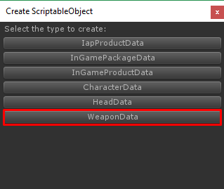
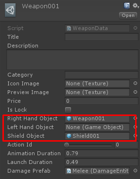
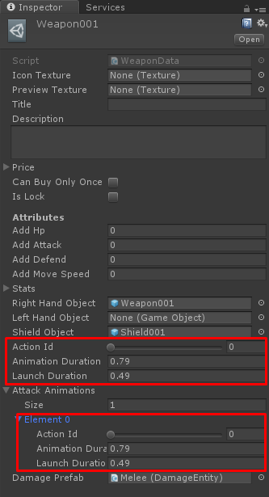
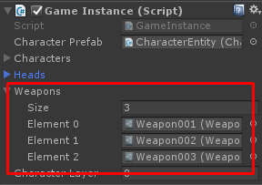

# How to add weapon item

Things you have to do to add new weapon item for this template are:

*   Prepare **Weapon Model**
*   Prepare **Damage Entity**
*   Create and set **Weapon Data**
*   Add created **Weapon Data** to **Game Instance**

Okay, Let’s start

## Prepare Weapon Model

First, prepare right hand / left hand weapon and/or shield models. You may create empty scene then drag your weapon model into the scene to manage them, Then make them as prefab

Next, you may like to create new Damage Entity, it’s a object which will take damage to character when it’s collided to the character

To create it you may prepare a model such as bullet model then add Damage Entity component, this component contains following configs

*   **Spawn Effect Prefab** is effect which will be played when spawn
*   **Explode Effect Prefab** is effect which will be played when it hit something or when it’s stayed over **Life Time**
*   **Hit Effect Prefab** is effect which will be played at characters that take damage
*   **Radius** is radius to taking damage to characters
*   **Life Time** is duration before destroying after spawned
*   **Spawn Forward Offset** is spawn forward offset from attacker character
*   **Speed** is movement speed
*   **Relate To Attacker** if this is true it position will be relates to attacker character

Then you have to add any collider to make it able to collided by characters

And then make it as prefab you will use it to set in **WeaponData**

## Create and set Weapon Data

Next, you have to create **WeaponData**, right click on anywhere in Project tab choose **Create -> ScriptableObject**

In **Create ScriptableObject** dialog choose **WeaponData**

Then in weapon data set weapon model prefabs that you have created to each type of position

Another parameter there are

*   **Action Id** is ID for attack animation that you can set condition in **CharacterAnimator** (Animator Controller) to play that attack animation
*   **Animation Duration** is total duration to play attack animation
*   **Launch Duration** is duration to launch attack damage, this value must less than or equal to Animation Duration
*   **Damage Prefab** is prefab of **DamageEntity** that will be launched when attack

For version 1.3 and above **Action Id**, **Animation Duration** and **Launch Duration** will be moved to **Attack Animations**

## Add created Weapon Data to Game Instance

Then open **Home** scene add weapon data to **GameInstance**

