# Character attack in depth

If you are already read **How to add new weapon item**, In that part you will see about **WeaponData** which contains **Action Id**, **Animation Duration** and **Launch Duration** that you may doubt how it working.

* * *

About **Action Id** we use it to determine which animation will play when attacking, you should set it relates to condition in **CharacterAnimator** which located at  BattleIO/Demo/Animations

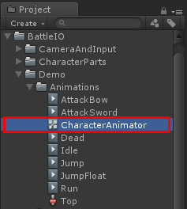

You can open it to add new Animation for this example I will show how I adding **Spear** attack animation

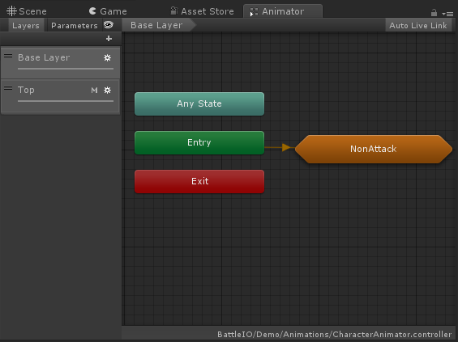

When you opened CharacterAnimator you will see tab like this

Then select **Top** layer because all attack animation have been set on that layer

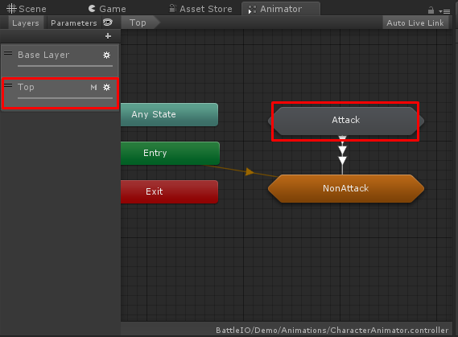

Select Top layer, then you will see Attack sub-state machine

Double click on **Attack** sub-state machine you will see how transition work to play attack animation

You can click on arrow line to see condition to play animation

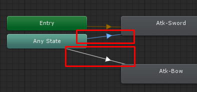

Select any arrow line

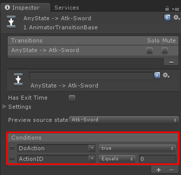

See conditions in Inspector

Then I will add new attack animation named **Atk-Spear**

Right click on space in Animator tab then select Create State -> Empty

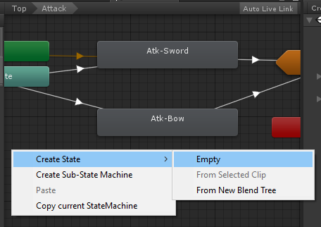

Then select new created State set it name to **Atk-Spear** and set its animation clip (Caution: Attack animation clip should not be loop)

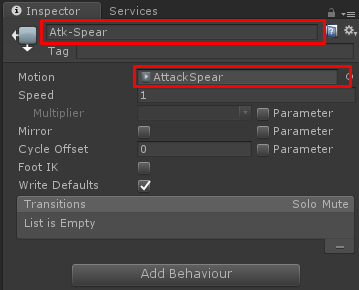

Then make transition from **Any State** to **Atk-Spear** and set its conditions

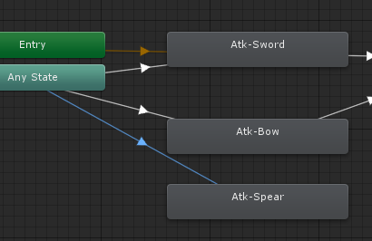

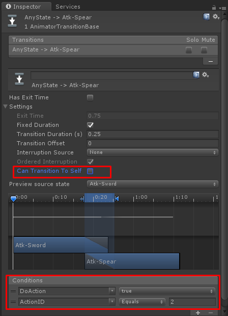

As above settings, I set **Can Transition To Self** as **False** because I don’t want it playing attack animation while last attack animation is not finish

Conditions **DoAction** is required to make it start playing attack animation it have been defined by codes (CharacterEntity.cs), **ActionID** equals to **2** to make condition to play this animation when equip weapon with its **Action Id** data equals to **2**

Then make transition from **Atk-Spear** to **Up** and select **NonAttack** state machine

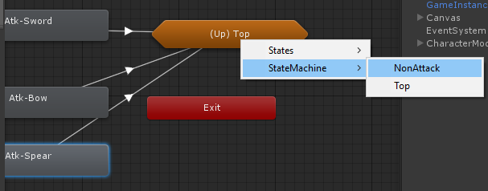

Then set conditions for this transition to stop playing this animation when **DoAction** equals to **False**

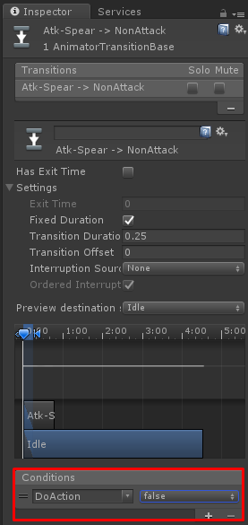

Then set **Action Id** in item data which you want to make it play this animation to **2**

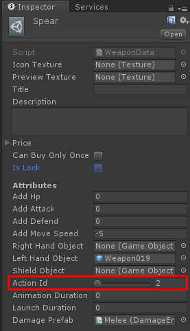

* * *

Next is about **Animation Duration** and **Launch Duration**

For **Animation Duration** setting we have to see duration of the animation it’s easy just see it in Animation Clip

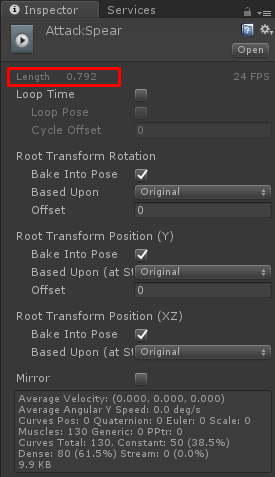

Then we’re going to find which duration is the frame attack character should launch damage entity, I’d recommend you to create new scene (File ->New Scene)

Then drag any character model (BattleIO/Demo/Prefabs/CharacterModel) to the scene and then open **Animation** tab via menu Window -> Animation

Select the character then in **Animation** tab select **AttackSpear** clip

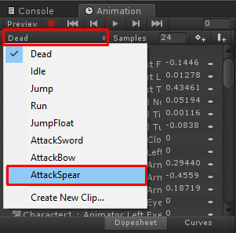

Then select frame which you want to launch damage entity

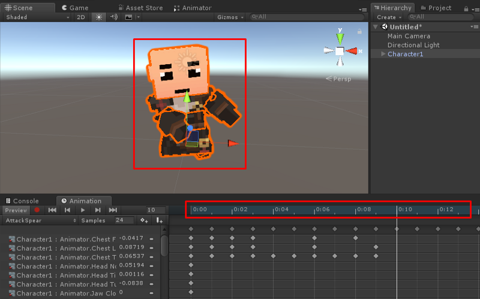

In this example selected frame is 10 of 18, then use **Animation Duration** with this to find **Launch Duration**

Let’s 10 is which percent of 18, it’s easy 10 / 18 \* 100 = 55, so it’s 55 %

Then use this percent to find **Launch Duration**, When **Animation Duration** equals to 0.79, 0.79 \* 55 / 100 = 0.4345, so this is amount of **Launch Duration**

If you want to increase speed for animation clip you have to change number of Samples then find **Animation Duration** and **Launch Duration** again

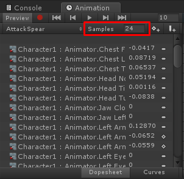

The number of Samples