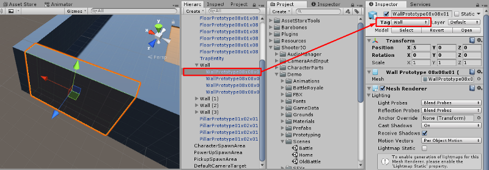
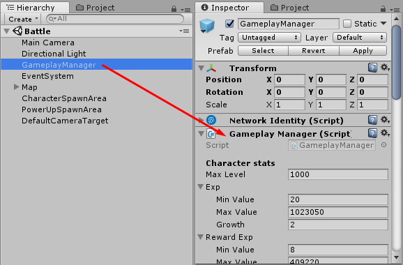
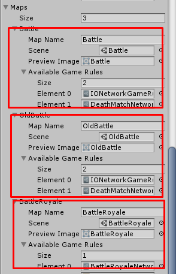

# How to add new scene

To add new scene, you have to prepare scene which have terrain, ground, wall

For all walls, you have to set tag to Wall to makes Bot character can avoid it

Then you have to add new game object which attach Gameplay Manager component

Then set its configs. Read \[ [THIS](https://medium.com/suriyun-production/battle-io-gameplay-configuration-4590c9e04d8c) \] for more information

Then add spawn area for where you want to spawn character, powerup. Read \[ [THIS](https://medium.com/suriyun-production/battle-io-spawn-area-b73e0923d1c9) \] for more information

Then after finish this, you have to add this map to map list in **Home** scene

Go to **Home** scene then find for **UI Lan Game Create** which located in Home scene / Canvas

Then go to **Maps** config section

Add your map and available game modes as you wish

