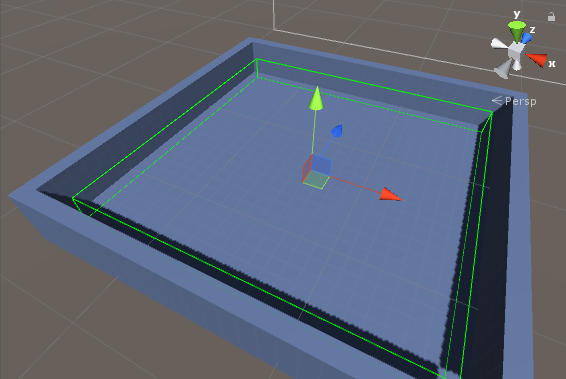
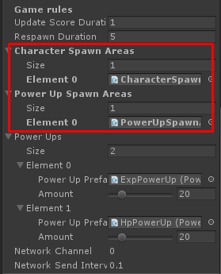

* * *

This is the guide for Battle IO game template which selling at Unity Asset Store ([https://www.assetstore.unity3d.com/#!/content/101113?aid=1100lGeN](https://www.assetstore.unity3d.com/#!/content/101113?aid=1100lGeN))

The **Spawn Area** is used to specific area to spawning character / power up objects in game play scene, spawn position will be random by its position +/- **Area Size X** / **Area Size Y**

You can see area to spawn characters or power ups when select the spawn area object

You can create new spawn area in **Battle** scene then add to **GameplayManager** in **Character Spawn Areas** or **Power Up Spawn Areas** field

