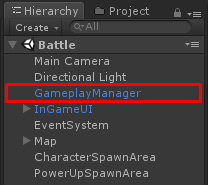

# Gameplay Manager configuration

In **Battle** scene you will see **GameplayManager** game object

You can set gameplay configuration here, There are following configs

*   **Max Level** is max level of all characters
*   **Exp** is min exp to max exp to level up characters with its growth potential
*   **Reward Exp** is min and max exp that will be received when killed enemy character
*   **Reward Currencies** is the list of currencies player will receive when killed enemy character
*   **Kill Score** is min and max score that will be received when killed enemy character
*   **Min Hp** is min Hp for all characters
*   **Min Attack** is min attack for all characters
*   **Min Defend** is min defend for all characters
*   **Min Move Speed** is min move speed for all characters
*   **Max Spread Damages** maximum about of damage entities that can be spawned when character attack
*   **Divide Spreaded Damage Amount** if this is `TRUE`, damage amount will be divided by amount of spread damages
*   **Adding​ ​Stat​ ​Point**​​ ​is​s​Stat​ ​point​ ​which​ ​will​ ​increase when​ ​level​ ​up​ ​this​ ​is​ ​required​ ​to​ ​add​ ​an​ ​stats
*   **Min Attack Vary Rate**, **Max Attack Vary Rate** are Rate that will be random by min and max value to multiply with attack
*   **Available Attributes** an character attributes, it will be random to let players choose which attributes they want to add when level up
*   **Watch Ads Respawn Available** is available amount to let player to watch Ads to respawn without reset stats
*   **Respawn Duration** duration to let players respawn after death
*   **Invincible Duration** duration for every character to be invincible after respawned
*   **Character Spawn Areas** is an **SpawnArea** that will be used to spawn characters when spawn / respawn
*   **Power Up Spawn Areas** is an **SpawnArea** that will be used to spawn power ups when spawn / respawn
*   **Power Ups** is an **Power Up Entity** prefab with amount to spawn