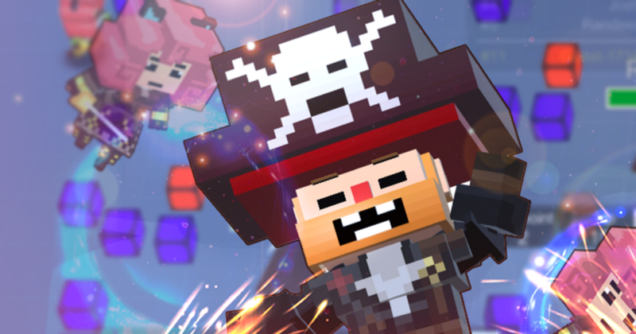

* * *

This is the guide for Battle IO game template which selling at Unity Asset Store ([https://www.assetstore.unity3d.com/#!/content/101113?aid=1100lGeN](https://www.assetstore.unity3d.com/#!/content/101113?aid=1100lGeN))

Now Battle IO is integrated Unity Ads monetization, it’s supports only Android and iOS.

You can enable Unity Ads, following the quick start guide ([https://unity3d.com/services/ads/quick-start-guide](https://unity3d.com/services/ads/quick-start-guide)). if you got an errors that relates to Unity Ads, you can try import Unity Ads package from Unity Asset Store ([https://www.assetstore.unity3d.com/en/#!/content/66123?aid=1100lGeN](https://www.assetstore.unity3d.com/en/#!/content/66123?aid=1100lGeN))

Battle IO is already implements watch Ads to receives gold and watch Ads to respawn character without stats reset but you still have to do some setup

In the **Home** scene, there is **GameInstance** game object in that game object you will see attached **Monetization Manager** component you have to set its **Android Game Id** and **iOS Game Id** you can find it in **Unity Ads Dashboard** ([https://dashboard.unityads.unity3d.com](https://dashboard.unityads.unity3d.com)). in the Dashboard scroll down, you will see project list, select you project you will see game Id

Then you have to set Ads placement, in the dashboard select project then select platform, in selected platform page you will see Ads placements list, each entry you will see **Placement Id** use them to set **Reward Video Placement** in the **Monetization Manager** component and **Watch Ads Respawn Placement** in the **Game Instance** component

An placement Id, You can create new placement via menu ADD NEW PLACEMENT

You can set how many currency player will receive after watched the Ads, in **Monetization Manager** component -> **Ads Reward Currency**

You can set time to let player to watch Ads to respawn without reset stats in **Battle** scene -> **GameplayManager** \-> **Watch Ads Respawn Available**