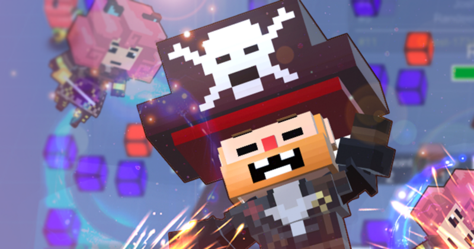

* * *

This is the guide for Battle IO game template which selling at Unity Asset Store ([https://www.assetstore.unity3d.com/#!/content/101113?aid=1100lGeN](https://www.assetstore.unity3d.com/#!/content/101113?aid=1100lGeN))

After you import the package you may found errors like this, it’s because this package required **Unity Purchasing** so you have to turn it on in **Services** tab and downloads its package, it’s explained here ([https://docs.unity3d.com/Manual/UnityIAPSettingUp.html](https://docs.unity3d.com/Manual/UnityIAPSettingUp.html))

If you enabled **Unity Purchasing** but an errors still occurs after imports packages you might have to import these two packages

